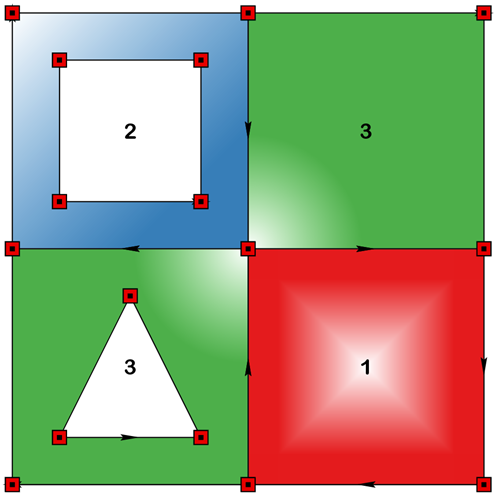

# Geo Numeracy

Things numeric relating to geometry and computational geometry that I have discovered.

* [Coordinates and shapes](/docs/coordinates.md)

  Planar/Euclidean space.  Basic coordinate notation. Creating basic geometric shapes and patterns.

* [Irregular shapes](/docs/geometry/Geometry_as_arrays.md)

  Real world shapes are rarely regular.  This section introduces the concepts of **object** array geometry.
  
* [Side](/docs/side.md)

  In, out, on, neither, both, left of, right of.
  Questions, questions.
  
* [Buffer mysteries](/docs/buffer/buffer_mysteries.md)

  Everyone loves a buffer.  Are they arcs? circles? or n-gons? 

* [Densify geometry](/docs/densify/Densify.md)

  Add points between vertices of polygon or polyline geometry.

* [Dissolve those boundaries](/docs/dissolve/Dissolve.md)

  Removing boundaries between polygon geometries.

* [Crossings](/docs/crossings.md)

  A brief introduction to segment crossing, the notation and basic equations.

  Crossings, crossroads (1) and intersections... the non-math stuff too.
  
* [Clipping](/docs/clipping.md)

  Clipping looks so easy... right? 

  All you have to do is cut stuff out and keep other stuff. 

  Oh.. and keep stuff in order while you are doing it.

  We will see how you mastered intersections as the first step to clipping and erasing and the like.

* [Clipping complex shapes](/docs/clipping/clip.md)

  Just when you thought you were grasping intersections and simple clipping.

(1)  Crossroad Blues : Robert Johnson, Eric Clapton or Ry Cooder versions are all just fine as study music.
