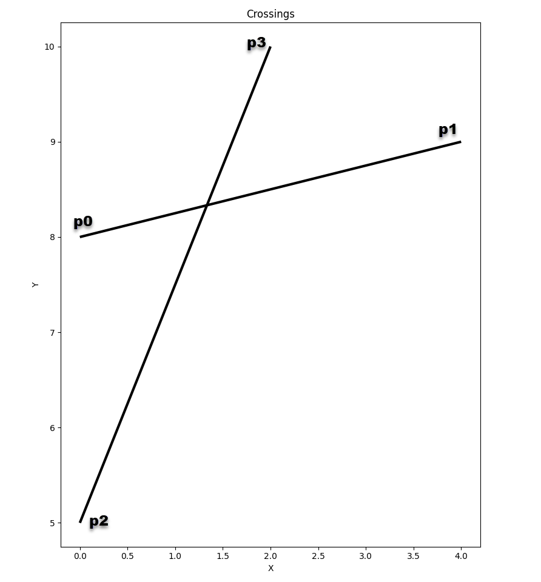

# Crossings



Points, lines, segments.  The basic entities.

Inside, outside, on, equal.  The basic questions.

Looks simple doesn't it, when you look at the image.

Two segments intersect/cross when they overlap.  This can include when both segments meet at a common point or when the start and end points are on opposite sides of the other segment AND their coordinates share the same spatial domain.

Intersection, or lack thereof, is the basis for many geometry problems but it isn't confined to geometry.


## Background

This section will lay the foundational terminology for this and subsequent sections.  The reference section contains links to those that I have found most useful.  It is not a complete or comprehensive list.


**Terms**

- point

    A location denoted by X, Y coordinates.  I only work with coordinates which are planar.  For the maths, think of an X,Y graph.  For those in the spatial fields, think `projected coordinates`, like UTM.

    Points are the basic building block of geometry.  I will ignore the `Z` axis/dimension for now.  If `X` and `Y` are used for location, then consider `Z` to represent height or some other measureable attribute for that location. 

- segment

    A portion of a `line`/`polyline`.  The connection between two points.  The second building block for polylines and polygons.
    
 - polyline and polygon

   I will use the terms `polyline` and `polygons` throughout.  The former represents the perimeter of the latter.


**Notations**

Points are represented by a numpy Nx2 ndarray.  For example, this is a square.  The first column is the X-coordinates and the second column is the Y-coordinates.

```
pnts # -- An array of points
array([[  0.00,   0.00],
       [  0.00,  10.00],
       [ 10.00,  10.00],
       [ 10.00,   0.00],
       [  0.00,   0.00]])
seg # -- the first segment of pnts showing from-to points
array([[  0.00,   0.00],
       [  0.00,  10.00]])

seg_ravel
array([  0.00,   0.00,   0.00,  10.00])  # -- same as seg, but with the pairs raveled/flattened

```
The array need not represent anything other a series of points.  In this particular case, it was used to represent a polyline and/or a polygon.
Why?  The points are ordered in clockwise order and the first and last points are the same.  Others use counter-clockwise order to represent poly/* geometries, but personally... I found it counter-productive ;).


```
pnts    - The points used to represent geometry.
x, y    - A generic point or series of points.  
          If `pnts` above, represented any set of points, then `x,y` would be used to represent their coordinates.
          If the points belonged to a segment, polyline or polygon, then one of the notations that follow would be
          used to indicate their special condition.
x0, y0  - The first two coordinates in `seg` or `seg_ravel`.  These represent the first point in a segment.
x1, y1  - The second two coordinates, representing the last point in the segment.
x2, y2  - As above, but for another segment
x3, y3
```

Now... having said the above.  I am rarely working with 2 segments or 4 points.
I consider `x0, y0` to represent all the x,y coordinates for all the primary segments I am studying.

If I wanted to find the intersections between 100 segments in one data set and 1000 segments in another data set, then

  - `x0,y0 and x1,y1` would represent the start and end points for the first data set (100 segments) and
  - `x2,y2 and x3,y3` would be those of the second data set (1000 segments).

If you are with me, then press on.


**Two equations with two unknowns**

```python                                                                                                 
     # the t_numer ==> ua                            alternate notation
                                                     dc_x = (x3 - x2)
                                                     dc_y = (y3 - y2)
     (x3 - x2) * (y0 - y2) - (y3 - y2) * (x0 - x2)   (y0 - y2) * dc_x - (x0 - x2) * dc_y
ua = --------------------------------------------  = ------------------------------------
     (y3 - y2) * (x1 - x0) - (x3 - x2) * (y1 - y0)   (x1 - x0) * dc_y - (y1 - y0) * dc_x

     # the s_numer ==> ub
     (x1 - x0) * (y0 - y2) - (y1 - y0) * (x0 - x2)   (y1 - y2) * dc_x - (x1 - x2) * dc_y
ub = --------------------------------------------  = ------------------------------------
     (y3 - y2) * (x1 - x0) - (x3 - x2) * (y1 - y0)   (x1 - x0) * dc_y - (y1 - y0) * dc_x

denominator = (y3 - y2) * (x1 - x0) - (x3 - x2) * (y1 - y0)
#           = (x1 - x0) * dc_y - (y1 - y0)  * dc_x

# numerator tests

a0 = (y0 - y2) * dc_x  # -- from ua
a1 = (x0 - x2) * dc_y
a = a_0 <= a_1

b0 = (y1 - y2) * dc_x  # -- from ub
b1 = (x1 - x2) * dc_y
b = b_0 <= b_1

x = x0 + ua * (x1 - x0)
y = y0 + ub * (y1 - y0)

```

----

## Crossing rules

Ok... lets use some points to follow along.
p0 -> p1 is the first segment and 
p2 -> p3 is the second segment.

```python
p0, p1, p2, p3 = np.array([[0., 8.], [4., 9], [0., 5.], [2.,10]])
```

**First check**

Given 4 points, if there are < 4 unique points, then the segments intersect at one of the points.


**Second check**

If the denominator in the above equations is zero (`denom == 0`), then there is no intersection.  The segments are either parallel or collinear but not touching.
```python
denom = x10 * y32 - y10 * x32  # -- 18.0  equivalent to ... np.cross(p1-p0, p3-p2)
```
So the segments do intersect (surprise!).


**Third, fourth and fifth checks**

Determine the other ``cross-products``.
```python
s_num = x10 * y02 - y10 * x02
t_num = x32 * y02 - y32 * x02
```

Determine whether all the points of each segment are on the same side of the opposing segment.
If they are, then the segments can't cross.

```python
denom_gt0 = denom > 0
if (s_num < 0) == denom_gt0:
    return (False, None)
if (t_num < 0) == denom_gt0:
    return (False, None)
if np.logical_or((s_num > denom) == denom_gt0, (t_num > denom) == denom_gt0)
    return (False, None)
```


**Final check**

The two segments intersect as shown in the figure.
```python
t = t_num / denom
x = x0 + t * x10
y = y0 + t * y10

x, y  # (1.333..., 8.333...)
```
It may look convoluted, but that is all it is doing... checking to see where the points reside with respect to their segments.

Here are the bits put altogether.

**NOW** of course it is pretty useless!  

Determining whether two segments intersect one pair at a time.  Numpy offers the capability to vectorize the calculations for multiple comparisons, whether it is one-to-many or many-to-many.  

The code is included in the ``scripts`` folder.


```python

def intersects(p0, p1, p2, p3):
    """Line segment intersection check. Four points required."""
    x0, y0, x1, y1, x2, y2, x3, y3 = *p0, *p1, *p2, *p3  # pnts to xs and ys

    # -- First check, but it is expensive, so I generally omit it initially.
    # Given 4 points, if there are < 4 unique, then the segments intersect
    u, cnts = np.unique((p0, p1, p2, p3), return_counts=True, axis=0)
    if len(u) < 4:
        intersection_pnt = u[cnts > 1]
        return True, intersection_pnt

    # -- Gather terms.
    x0, y0 = p0
    x10, y10 = p1 - p0
    x32, y32 = p3 - p2
    x02, y02 = p0 - p2
    #
    # -- Second check ----   denom = np.cross(p1-p0, p3-p2)
    # denom = (x1 - x0) * (y3 - y2) - (y1 - y0) * (x3 - x2)
    denom = x10 * y32 - y10 * x32
    if denom == 0.0:  # "(1) denom = 0 ... collinear/parallel"
        return (False, None)
    #
    # -- Third check ----  s_num = np.cross(p1-p0, p0-p2)
    denom_gt0 = denom > 0  # denominator greater than zero
    # s_num = (x1 - x0) * (y0 - y2) - (y1 - y0) * (x0 - x2)
    s_num = x10 * y02 - y10 * x02
    if (s_num < 0) == denom_gt0:  # "(2) (s_n < 0) == (denom > 0) : False"
        return (False, None)
    #
    # -- Fourth check ----  np.cross(p3-p2, p0-p2)
    # t_num = (x3 - x2) * (y0 - y2) - (y3 - y2) * (x0 - x2)
    t_num = x32 * y02 - y32 * x02
    if (t_num < 0) == denom_gt0:  # "(3) (t_n < 0) == (denom > 0) : False"
        return (False, None)
    #
    # -- Fifth check ----
    t4 = np.logical_or(
        (s_num > denom) == denom_gt0, (t_num > denom) == denom_gt0)
    if t4:  # "(4) numerator checks fail"
        return (False, None)
    #
    # -- check to see if the intersection point is one of the input points
    # substitute p0 in the equation  These are the intersection points
    t = t_num / denom
    x = x0 + t * x10  # (x1 - x0)
    y = y0 + t * y10  # (y1 - y0)
    #
    # be careful that you are comparing tuples to tuples, lists to lists
    if sum([(x, y) == tuple(i) for i in [p0, p1, p2, p3]]) > 0:
        # return (True, "(5) intersects at an input point {}, {}".format(x, y))
        return (True, (x, y))
    return (True, (x, y))
```


References
----------
[Paul Bourke geometry](http://paulbourke.net/geometry/pointlineplane/)
