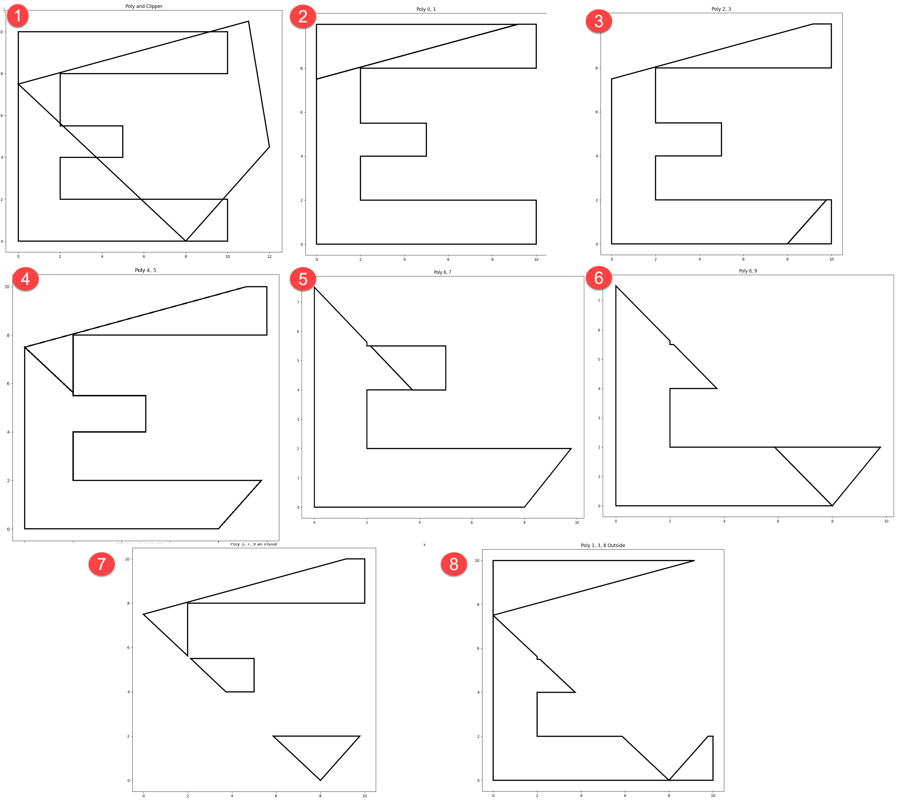

## Clipping



The image to the right shows the results of intersecting two sets of segments which coincedently form two polygons.

The sequential steps show how each segment of the `clipper` intersects with the segments of `poly`.

The clips are keep in a `left of` and `right of` containers (read... outside vs inside).

The `right of` data are used in the next clipping step... and so on, and so on.

At the end, it is simply a matter of organizing the `outside` and `inside` bits (aka, erase and clip).

Note the word `simply`.  This is where the `yeah but...` comments start.  
All the corner cases, where things aren't so *simple*.

The journey begins.

---

The intersection points between the point sets was determined using ``p_c_p`` below.

The coordinates for the inputs are.

```
#      poly                  clipper 
array([[  0.00,   0.00],   array([[  0.00,   7.50],
       [  0.00,  10.00],          [ 11.00,  10.50],
       [ 10.00,  10.00],          [ 12.00,   4.50],
       [ 10.00,   8.00],          [  8.00,   0.00],
       [  2.00,   8.00],          [  0.00,   7.50]])
       [  2.00,   5.50],
       [  5.00,   5.50],
       [  5.00,   4.00],
       [  2.00,   4.00],
       [  2.00,   2.00],
       [ 10.00,   2.00],
       [ 10.00,   0.00],
       [  0.00,   0.00]])
```

They can be rearranged to form the raveled point pairs, which are useful for some functions

```
np.concatenate([poly[:-1], poly[1:]], axis=1)
np.concatenate([clipper[:-1], clipper[1:]], axis=1)

#  poly as segments                           clipper as segments
array([[  0.00,   0.00,   0.00,  10.00],  array([[  0.00,   7.50,  11.00,  10.50],
       [  0.00,  10.00,  10.00,  10.00],         [ 11.00,  10.50,  12.00,   4.50],
       [ 10.00,  10.00,  10.00,   8.00],         [ 12.00,   4.50,   8.00,   0.00],
       [ 10.00,   8.00,   2.00,   8.00],         [  8.00,   0.00,   0.00,   7.50]])
       [  2.00,   8.00,   2.00,   5.50],
       [  2.00,   5.50,   5.00,   5.50],
       [  5.00,   5.50,   5.00,   4.00],
       [  5.00,   4.00,   2.00,   4.00],
       [  2.00,   4.00,   2.00,   2.00],
       [  2.00,   2.00,  10.00,   2.00],
       [ 10.00,   2.00,  10.00,   0.00],
       [ 10.00,   0.00,   0.00,   0.00]])

```

Or they can be shaped to from 3D arrays of coordinates of from-to pairs.

```
np.concatenate([poly[:-1], poly[1:]], axis=1).reshape(-1, 2, 2)
np.concatenate([clipper[:-1], clipper[1:]], axis=1).reshape(-1, 2, 2)

#  poly as from-to point pairs    clipper as from-to point pairs
array([[[  0.00,   0.00],         array([[[  0.00,   7.50],
        [  0.00,  10.00]],                [ 11.00,  10.50]],
       [[  0.00,  10.00],                [[ 11.00,  10.50],
        [ 10.00,  10.00]],                [ 12.00,   4.50]],
...    snip                       ...    snip
       [[ 10.00,   2.00],                [[  8.00,   0.00],
        [ 10.00,   0.00]],                [  0.00,   7.50]]])
       [[ 10.00,   0.00],
        [  0.00,   0.00]]])
```

The resultant intersections between the segments are shown below.

If you examine the poly ID and clip ID columns and the figure above, you will see how one can sequentially construct a ``clip`` or ``erase`` from the intersection points and the point inside and/or outside their respective segments.

Steps 7 and 8 in the image represent the cases where segments that are `inside` the clipper bounds are kept (clip, step 7) or are removed (erase, step 8).

How you can assemble the ``bits`` for form polygons will be the subject of a subsequent document.

I won't become obvious anytime soon, but study the coordinates, their arrangements, the intersections and the image in the interim.

More later.

```
# intersections            poly clip
#          X       Y        ID   ID
array([[  0.00,   7.50],   [ 0,   0],
       [  0.00,   7.50],   [ 0,   3],
       [  9.17,  10.00],   [ 1,   0],
       [  2.00,   5.62],   [ 4,   3],
       [  2.13,   5.50],   [ 5,   3],
       [  3.73,   4.00],   [ 7,   3],
       [  9.78,   2.00],   [ 9,   2],
       [  5.87,   2.00],   [ 9,   3],
       [  8.00,   0.00],   [11,   2],
       [  8.00,   0.00]]), [11,   3]

```

```
def p_c_p(clipper, poly):
    """intersect poly features.

    Parameters
    ----------
    clipper, poly : array_like
         Clockwise-ordered sequence of points (x, y) with the first and last
         point being the same. The `clipper` is the polygon or polylines
         cutting the `poly` geometry.
    """
    p_cl, c_cl = [i.XY if hasattr(i, "IFT") else i for i in [poly, clipper]]
    x3_x2, y3_y2 = (p_cl[1:] - p_cl[:-1]).T
    dc = c_cl[1:] - c_cl[:-1]
    dc_x = dc[:, 0][:, None]
    dc_y = dc[:, 1][:, None]
    pc02 = p_cl[:-1] - c_cl[:-1][:, None]
    pc02_x = pc02[..., 0]
    pc02_y = pc02[..., 1]
    # --
    d_nom = (x3_x2 * dc_y) - (y3_y2 * dc_x)
    a_0 = pc02_y * dc_x
    a_1 = pc02_x * dc_y
    b_0 = x3_x2 * pc02_y
    b_1 = y3_y2 * pc02_x
    a_num = a_0 - a_1  # (p02_y * dc_x) - (p02_x * dc_y)
    b_num = b_0 - b_1  # (x3_x2 * p02_y) - (y3_y2 * p02_x)
    with np.errstate(all='ignore'):  # divide='ignore', invalid='ignore'):
        u_a = a_num/d_nom
        u_b = b_num/d_nom
        z0 = np.logical_and(u_a >= 0., u_a <= 1.)
        z1 = np.logical_and(u_b >= 0., u_b <= 1.)
        both = z0 & z1
        xs = u_a * x3_x2 + p_cl[:-1][:, 0]
        ys = u_a * y3_y2 + p_cl[:-1][:, 1]
    xs = xs[both]
    ys = ys[both]
    pc_ids = np.vstack(both.nonzero()).T
    if xs.size > 0:
        final = np.zeros((len(xs), 2))
        final[:, 0] = xs
        final[:, 1] = ys
        return final, both, pc_ids  # poly_clipper_ids
    return None, both, None
