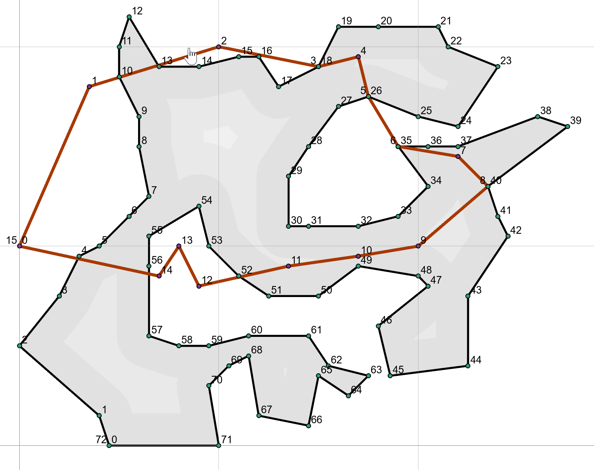
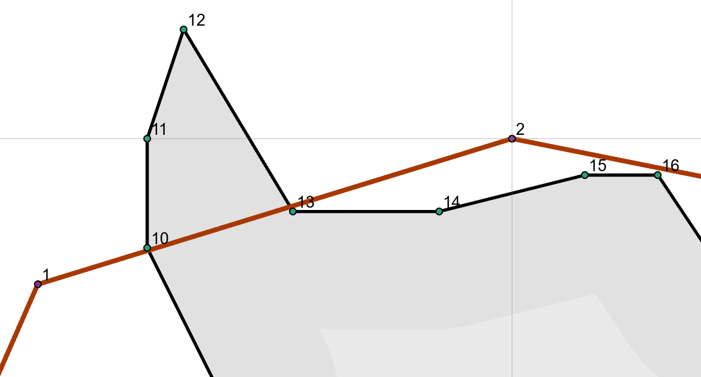
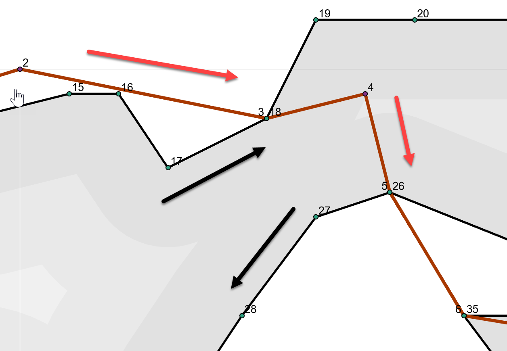
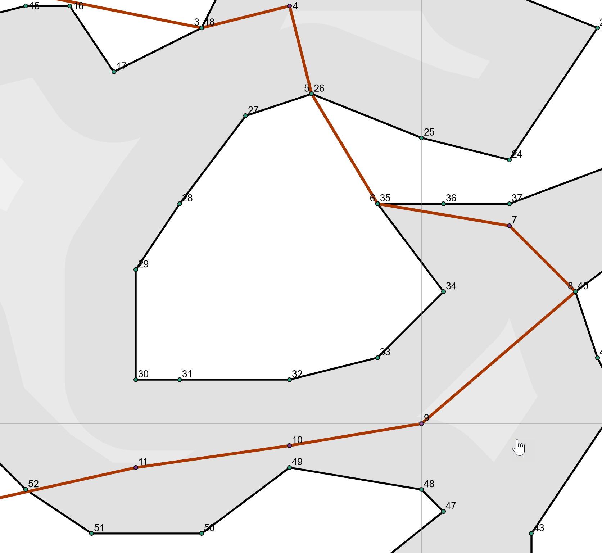
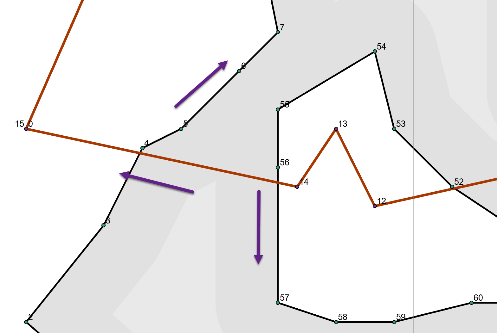

## Clipping ... beyond simple ##



Let us take a tour around the two polygon shapes to the right.

The top right hand corner of the image to the right is enlarged below.  Clipping one shape with the other will obviously leave parts inside and outside the other.

The intersection points, for the most part, occur along the segments.  Several intersections occur at the polygon nodes which creates special challenges during clipping.

Both polygons are clockwise oriented and their points are numbered.

If we assign the clipper polygon the variable name `clp` and the polygon being clipped `poly`, then the coincident points can be determined using numpy's `nonzero` and array broadcasting to do the comparison.

<br /><br />

In this document, polygons segments are denoted using their start point.



<br /><br /><br /><br /><br /><br /><br />



The two polygons can be either the clipping polygon or the polygons being clipped.

Consider the red polygon as the clipping polygon and the black polygon as the one being clipped:

- segment 0  on the left side of the image, is formed by points 0-1.  It has no intersections with the other polygon.
- segment 1  intersects segments 9 and 12, and the intersections are along the length of the segment
- segment 2  It looks like it doesn't intersect anything, but, its endpoint does. This type of intersection is the most problematic because it intersects the ...
  - endpoint of segment 17
  - start point of segment 18 and
  - it also represents the startpoint of its own segment 3
- segment 3  its start point is the endpoint of segment 2, so it will share the same intersections as those found for segment 2

There are 4 intersections points that are similar to the one discussed above.  I can identify those using a function to yield various point equality values.  These are named in the code block below.

```

# -- clp and poly are Nx2 arrays of point coordinates with
#    shapes of (16, 2) and (73, 2) respectively.

c_eq_p, p_eq_c = np.nonzero((clp == poly[:, None]).all(-1))

c_eq_p  # -- clipper point equals polygon point
[3, 5, 6, 8]

c_eq_x  # -- clipper point is an intersection
[3, 5, 6, 8]

p_eq_c  # -- polygon point equals clipper point
[18, 26, 35, 40]

p_eq_x  # -- polygon point is an intersection
[18, 26, 35, 40]
```
When paired, (3, 18), (5, 26), (6, 35) and (8, 40).  If we look at the points generated by the intersection operation, you will notice that they are in pairs.  The pairs can be extracted using the `c_eq_x` and `p_eq_x` values.
```
# -- intersection points are annotated
x_pnts  # -- the intersection points for the segments
array([[  5.02,  18.47],  # -- clipper 1 intersections
       [  6.96,  19.06],
       ---
       [ 15.00,  19.00],  # -- c_eq_x and p_eq_x
       [ 15.00,  19.00],
       [ 15.00,  19.00],
       [ 15.00,  19.00],
       ---
       [ 17.50,  17.50],  # -- c_eq_x and p_eq_x
       [ 17.50,  17.50],
       [ 17.50,  17.50],
       [ 17.50,  17.50],
       ---
       [ 19.00,  15.00],  # -- c_eq_x and p_eq_x
       [ 19.00,  15.00],
       [ 19.00,  15.00],
       [ 19.00,  15.00],
       ---
       [ 23.50,  13.00],  # -- c_eq_x and p_eq_x
       [ 23.50,  13.00],
       [ 23.50,  13.00],
       [ 23.50,  13.00],
       ---
       [ 11.06,   8.46],  # -- clipper 11 intersection
       [  2.94,   9.37],  # -- clipper 14 intersections
       [  6.50,   8.61]])

poly[p_eq_x]
array([[ 15.00,  19.00],
       [ 17.50,  17.50],
       [ 19.00,  15.00],
       [ 23.50,  13.00]])

clp[c_eq_x]
array([[ 15.00,  19.00],
       [ 17.50,  17.50],
       [ 19.00,  15.00],
       [ 23.50,  13.00]])

x0x1[c_eq_x]
array([[[ 17.50,  17.50],
        [ 17.50,  17.50]],

       [[ 19.00,  15.00],
        [ 19.00,  15.00]],

       [[ 19.00,  15.00],
        [ 19.00,  15.00]],

       [[ 23.50,  13.00],
        [ 23.50,  13.00]]])
```

<br /><br /><br /><br />

The intersecting segments point ids and whether they are inside each other are denoted in an array structure as follows:
```
# -- before processing
# -----------------
xCheck 
array([[ 1,  1,  9, 12,  0,  0,  1,  0],
       [ 2,  2, 17, 18,  0,  0,  1,  1],
       [ 3,  3, 17, 18,  1,  1,  1,  1],  # omitted
       [ 4,  4, 25, 26,  1,  1,  0,  1],
       [ 5,  5, 25, 26,  1,  1,  0,  1],
       [ 5,  5, 34, 35,  1,  1,  1,  1],  # omitted
       [ 6,  6, 34, 35,  1,  1,  1,  1],  # omitted
       [ 7,  7, 39, 40,  1,  1,  0,  1],
       [ 8,  8, 39, 40,  1,  1,  0,  1],  # omitted
       [11, 14, 51,  3,  1,  0,  0,  0],
       [14, -1, 56, -1,  0,  0,  1,  0]], dtype=int64)
	   
# -- after processing
# ----------------
np.asarray([i[0] for i in tot_])
array([[ 1,  1,  9, 12,  0,  0,  1,  0],
       [ 2,  2, 17, 18,  0,  0,  1,  1],
       [ 4,  4, 25, 26,  1,  1,  0,  1],
       [ 5,  5, 34, 35,  1,  1,  1,  1],
       [ 7,  7, 39, 40,  1,  1,  0,  1],
       [11, 14, 51,  3,  1,  0,  0,  0],
       [14, -1, 56, -1,  0,  0,  1,  0]], dtype=int64)

```
When processed, only certain intersections are considered to form the final clipped polygons.


----

<br /><br />

----
third


----
fourth


