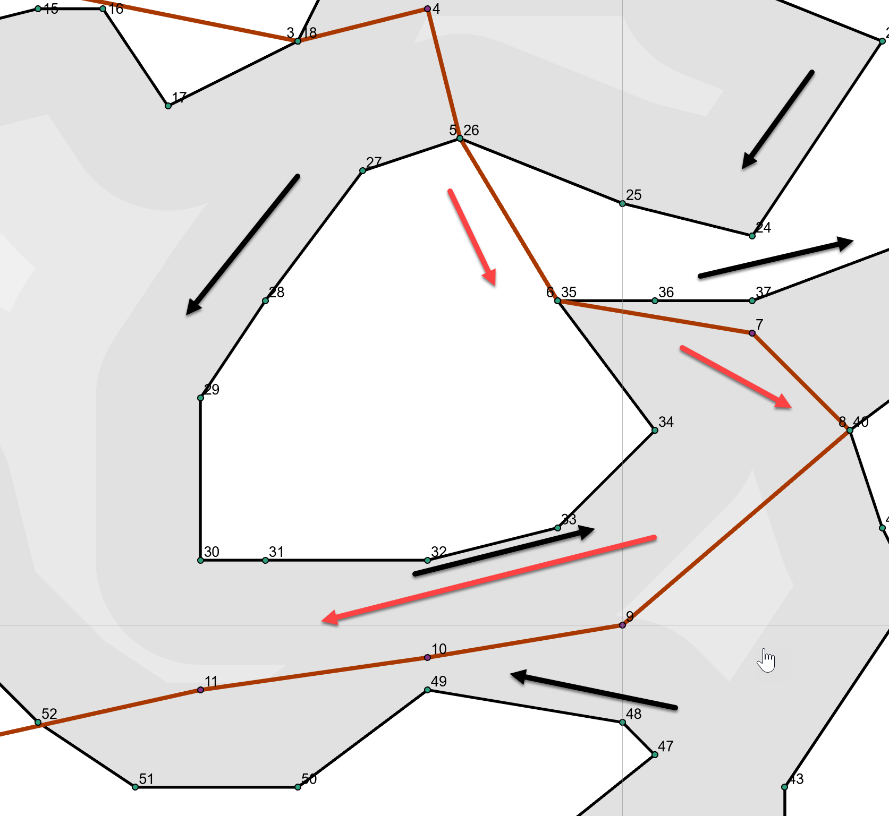

## Clipping ... beyond simple ##

Let us take a tour around the two polygon shapes to the right. Clipping one shape with the other will obviously leave parts inside and outside the other.

The intersection points, for the most part, occur along the segments.  Several intersections occur at the polygon nodes which creates special challenges during clipping.

----

1

2

3

4

5

second

1

2

3

4

5

third

1

2

3

4

5

6

fourth

1

2

3

4

5

6
