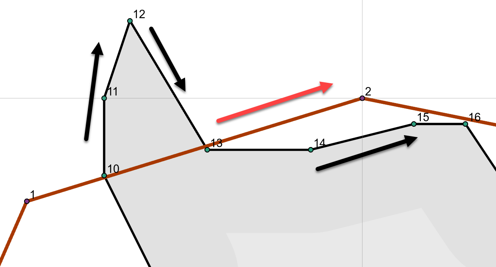

## Clipping ... beyond simple ##


Let us take a tour around the two polygon shapes to the right. Clipping one shape with the other will obviously leave parts inside and outside the other.

The intersection points, for the most part, occur along the segments.  Several intersections occur at the polygon nodes which creates special challenges during clipping.

In this document, polygons segments are denoted using their start point.  The two polygons can be either the clipping polygon or the polygons being clipped.  Consider the red polygon as the clipping polygon and the black polygon as the one being clipped:

- segment 0  on the left side of the image, is formed by points 0-1.  It has no intersections with the other polygon.
- segment 1  intersects segments 9 and 12, and the intersections are along the length of the segment
- segment 2  It looks like it doesn't intersect anything, but, its endpoint does. This type of intersection is the most problematic because it intersects the ...
  - endpoint of segment 17
  - start point of segment 18 and
  - it also represents the startpoint of its own segment 3
- segment 3  its start point is the endpoint of segment 2, so it will share the same intersections as those found for segment 2
<br />
<br />
<br />
<br />
<br />
<br />

----

The top right hand corner of the image above is enlarged to the right.



Both polygons are clockwise oriented and their points are numbered.

If we assign the clipper polygon the variable name `clp` and the polygon being clipped `poly`, then the coincident points can be determined using numpy's `nonzero` and array broadcasting to do the comparison.

<br />
<br />

```
# -- clp and poly are Nx2 arrays of point coordinates with shapes of (16, 2) and (73, 2) respectively.

c_eq_p, p_eq_c = np.nonzero((clp == poly[:, None]).all(-1))

c_eq_p  # array([18, 26, 35, 40], dtype=int64)
p_eq_c  # array([3, 5, 6, 8], dtype=int64)

clp[p_eq_c]
Geo([[ 15.00,  19.00],
     [ 17.50,  17.50],
     [ 19.00,  15.00],
     [ 23.50,  13.00]])

poly[c_eq_p]
Geo([[ 15.00,  19.00],
     [ 17.50,  17.50],
     [ 19.00,  15.00],
     [ 23.50,  13.00]])


```

----
third


1

2

3

4

5

6


fourth


1

2

3

4

5

6
