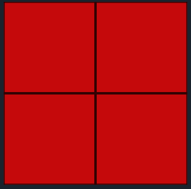
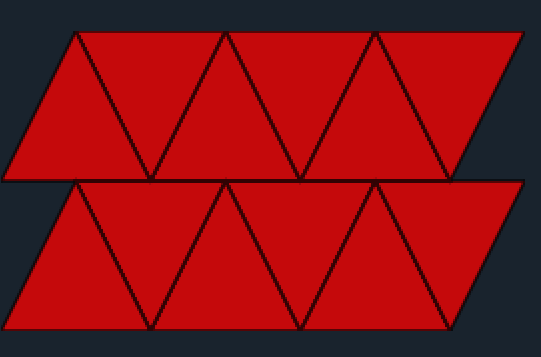
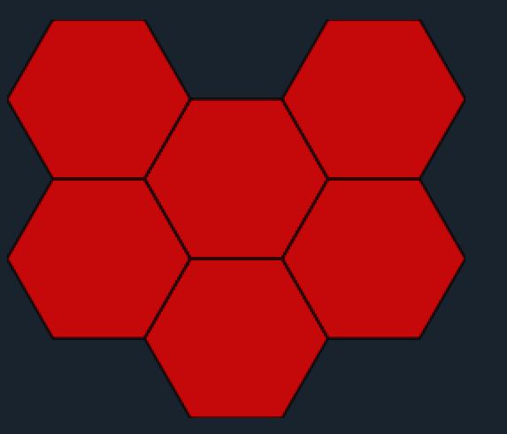
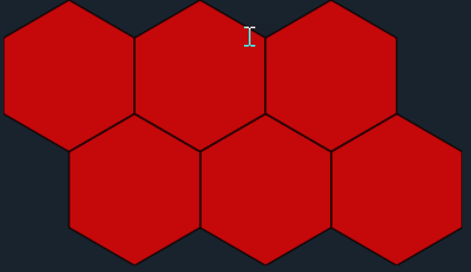

# Coordinates and NumPy

NumPy ndarrays can be used to represent simple 2D and 3D geometry objects.

The square ``A`` is simply constructed from 2D points ordered in a clockwise fashion with the first and last point being equal.
That geometry also represents a polyline, the polygons's perimeter.

```python
In [1]: A  # -- a square, oriented clockwise
Out[1]:
array([[  0.00,   0.00],
       [  0.00,  10.00],
       [ 10.00,  10.00],
       [ 10.00,   0.00],
       [  0.00,   0.00]])
```

We can translate it (move it) by adding/subtracting values from both the X and Y values.
```python
In [2]:A + [2., 2.]
Out[2]:
array([[  2.00,   2.00],
       [  2.00,  12.00],
       [ 12.00,  12.00],
       [ 12.00,   2.00],
       [  2.00,   2.00]])
```
Do simple math, like the average including all points and excluding certain points like the duplicate start/end point.

```python
In [3]: np.mean(A, axis=0)
Out[3]: array([  4.00,   4.00])

In [4]: np.mean(A[:-1], axis=0)
Out[4]: array([  5.00,   5.00])
```
The ``[:-1]`` in [4] represents `slicing`.  The interpretation, then reads, `use all values up to, but not including the last` (-1, counting back from the end.).
It could have also have been written as ``A[:4]`` meaning include all points up to the 4th index.

Slicing takes a simple format.  *array[start index: stop index: step]*.  You need to remember that arrays use a 0-based count, so index value 1, is the second entry.
The following shows how to slice *A* starting at index position 1, up to index 5, sampling every 2nd value
```python
In [5]: A[1:5:2]
Out[5]: 
array([[  0.00,  10.00],
       [ 10.00,   0.00]])
```

----
# Creating geometry

A number of standard geometric patterns can be created readily using numpy.  The basic code and examples follow.

### Rectangles

The pattern for a sequence of rectanges requires:
  - a increment for both the x and y directions (dx and dy)
  - an origin for the bottom left corner
  - the number of rows and columns to create

For example
```python
In [1]: rectangle(dx=1, dy=-1, x_cols=2, y_rows=2, orig_x=0, orig_y=1)
Out[1]: 
array([[[   0.0,    0.0],
        [   0.0,    1.0],
        [   1.0,    1.0],
        [   1.0,    0.0],
        [   0.0,    0.0]],

       [[   1.0,    0.0],
        [   1.0,    1.0],
        [   2.0,    1.0],
        [   2.0,    0.0],
        [   1.0,    0.0]],

       [[   0.0,    1.0],
        [   0.0,    2.0],
        [   1.0,    2.0],
        [   1.0,    1.0],
        [   0.0,    1.0]],

       [[   1.0,    1.0],
        [   1.0,    2.0],
        [   2.0,    2.0],
        [   2.0,    1.0],
        [   1.0,    1.0]]])
```

The function code with a full documentation string follows.

```python
def rectangle(dx=1, dy=-1, x_cols=1, y_rows=1, orig_x=0, orig_y=1):
    """Create a point array to represent a series of rectangles or squares.

    Parameters
    ----------
    dx, dy : number
        x direction increment, +ve moves west to east, left/right.
        y direction increment, -ve moves north to south, top/bottom.
    x_cols, y_rows : integers
        The number of columns and rows to produce.
    orig_x, orig_y : number
        Planar coordinates assumed.  You can alter the location of the origin
        by specifying the correct combination of (dx, dy) and (orig_x, orig_y).
        The defaults produce a clockwise, closed-loop geometry, beginning and
        ending in the upper left.

    Example
    -------
    Stating the obvious... squares form when dx == dy.

    X = [0.0, 0.0, dx, dx, 0.0] # X, Y values for a unit square
    Y = [0.0, dy, dy, 0.0, 0.0]

    Cells are constructed clockwise from the bottom-left.  The rectangular grid
    is constructed from the top-left.  Specifying an origin (upper left) of
    (0, 2) yields a bottom-right corner of (3,0) when the following are used.

    >>> z = rectangle(dx=1, dy=1, x_cols=3, y_rows=2, orig_x=0, orig_y=2)

    The first `cell` will be in the top-left and the last `cell` in the
    bottom-right.
    """
    seed = np.array([[0.0, 0.0], [0.0, dy], [dx, dy], [dx, 0.0], [0.0, 0.0]])
    a = [seed + [j * dx, i * dy]      # make the shapes
         for i in range(0, y_rows)      # cycle through the rows
         for j in range(0, x_cols)]     # cycle through the columns
    a = np.asarray(a) + [orig_x, orig_y-dy]
    return a
```
The result.



### Triangles


The pattern for a sequence of triangles requires:
  - a increment for both the x and y directions (dx and dy)
  - the number of rows and columns to create

```python
# Create a series of triangles with 3 columns and 2 rows, with X, Y steps of 1x1.  The lower left is at (0, 0).
In [1]: a = triangle(dx=1, dy=1, x_cols=3, y_rows=2, orig_x=0, orig_y=1)
In [2]: a
Out[2]: 
array([[[  0.000,   0.000],
        [  0.500,   1.000],
        [  1.000,   0.000],
        [  0.000,   0.000]],

       [[  0.500,   1.000],
        [  1.500,   1.000],
        [  1.000,   0.000],
        [  0.500,   1.000]],
        ... snip ...
In [3]: a.shape
Out[3]: (12, 4, 2)
```


A `seed` shape consists of two triangles, one pointing up and one down.  This is the basic building block which is repeated.

```python
def triangle(dx=1, dy=1, x_cols=1, y_rows=1, orig_x=0, orig_y=1):
    """Create a row of meshed triangles.

    The triangles are essentially bisected squares and not equalateral.
    The triangles per row will not be terminated in half triangles to
    `square off` the area of coverage.  This is to ensure that all geometries
    have the same area and point construction.

    Parameters
    ----------
    See `rectangles` for shared parameter explanation.
    """
    a, dx, b = dx/2.0, dx, dx*1.5
    # X, Y values for a unit triangle, point up and point down
    seedU = np.array([[0.0, 0.0], [a, dy], [dx, 0.0], [0.0, 0.0]])
    seedD = np.array([[a, dy], [b, dy], [dx, 0.0], [a, dy]])
    seed = np.array([seedU, seedD])
    a = [seed + [j * dx, i * dy]       # make the shapes
         for i in range(0, y_rows)       # cycle through the rows
         for j in range(0, x_cols)]      # cycle through the columns
    a = np.asarray(a)
    s1, s2, s3, s4 = a.shape
    a = a.reshape(s1 * s2, s3, s4)
    return a
```
The result.



### Hexagons


There are two variants of hexagons, which I can flat-headed and pointy-headed.  Those aren't the official names of course.

The seed entails cycling around the angles of a circle in 60 degree increments with different starting points for the two variants
and producing the boundaries based on increments of x and y to form the sides of the hexagons.  The two variants are shown below the code examples.  I haven't included the code for filling in the half hexagons should you want to fill those in.  It is sometimes quicker to form extra columns and rows then clip with the desired rectangular extent.

```python
def hex_flat(dx=1, dy=1,
             x_cols=1, y_rows=1,
             orig_x=0, orig_y=0,
             upper_left=True,
             asGeo=True, kind=2):
    """Generate the points for the flat-headed hexagon.

    Parameters
    ----------
    See `rectangles` for shared parameter explanation.

    Notes
    -----
    The origin is center of the top-left full cell, not the upper left point 
    """
    f_rad = np.deg2rad([180., 120., 60., 0., -60., -120., -180.])
    X = np.cos(f_rad) * dy
    Y = np.sin(f_rad) * dy            # scaled hexagon about 0, 0
    seed = np.array(list(zip(X, Y)))  # array of coordinates
    _dx_ = dx * 1.5
    _dy_ = dy * np.sqrt(3.) / 2.0
    if upper_left:
        y_fac = -_dy_
    else:
        y_fac = _dy_
    hexs = [seed + [_dx_ * i, y_fac * (i % 2)] for i in range(0, x_cols)]
    m = len(hexs)
    for j in range(1, y_rows):  # create the other rows
        hexs += [hexs[h] + [0, -_dy_ * 2 * j] for h in range(m)]
    hexs = np.asarray(hexs) + [orig_x + dx, orig_y - dy]  # 2026-04-28
    if asGeo:
        frmt = "dx {}, dy {}, x_cols {}, y_rows {}, LB ({},{})"
        txt = frmt.format(dx, dy, x_cols, y_rows, orig_x, orig_y)
        k = kind if kind in [1, 2] else 2
        return arrays_to_Geo(hexs, kind=k, info=txt)
    return hexs
```

The pointy-head version

```python
def hex_pointy(dx=1, dy=1,
               x_cols=1, y_rows=1,
               orig_x=0, orig_y=0,
               asGeo=True, kind=2):
    """Create pointy hexagons. Also called ``traverse hexagons``.

    Parameters
    ----------
    See `rectangles` for shared parameter explanation.

    Notes
    -----
    The origin is center of the top-left full cell, not the upper left point
    """
    p_rad = np.deg2rad([150., 90., 30., -30., -90., -150., 150.])
    X = np.cos(p_rad) * dx
    Y = np.sin(p_rad) * dy      # scaled hexagon about 0, 0
    seed = np.array(list(zip(X, Y)))
    _dx_ = dx * np.sqrt(3.) / 2.0
    _dy_ = dy * 1.5
    hexs = [seed + [_dx_ * i * 2, 0] for i in range(0, x_cols)]
    m = len(hexs)
    for j in range(1, y_rows):  # create the other rows
        hexs += [hexs[h] + [_dx_ * (j % 2), -_dy_ * j] for h in range(m)]
    hexs = np.asarray(hexs) + [orig_x, orig_y]  # 2026-04-26 dropped -dy
    if asGeo:
        frmt = "dx {}, dy {}, x_cols {}, y_rows {}, LB ({},{})"
        txt = frmt.format(dx, dy, x_cols, y_rows, orig_x, orig_y)
        k = kind if kind in [1, 2] else 2
        return arrays_to_Geo(hexs, kind=k, info=txt)
    return hexs
```



More geometry objects can be found in the npg_create.py script which is part of the numpy geometry module.

[(1) Array Broadcasting](https://numpy.org/devdocs/user/basics.broadcasting.html)



That is basic hexagons.

More shapes can be created using *npg_create.py* in

[(2) numpy geometry](https://github.com/Dan-Patterson/numpy_geometry/blob/master/arcpro_npg/npg/npg/npg_create.py)


