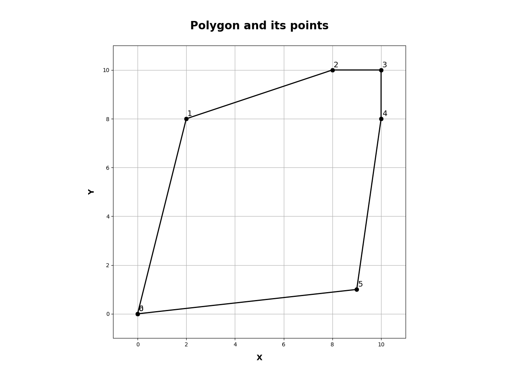
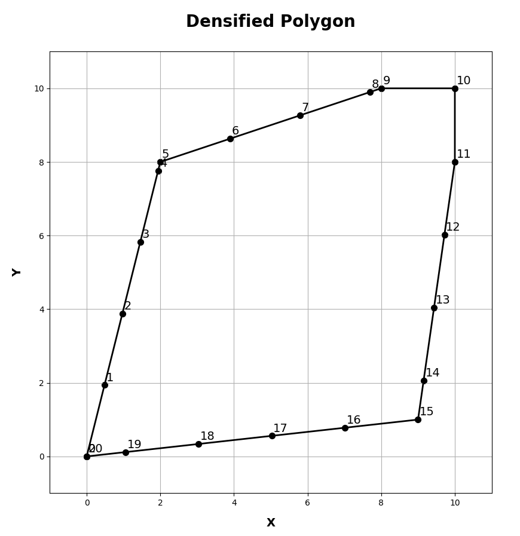

## Densify Geometry ##

Densification of polygon boundaries or polyline segments, is a common task.
In a previous incarnation, I wrote about densifying geometry based on a "factor", that is, double, triple... the number of points along a segment. 

Planar densification can be carried out in Editing Tools, with several options.  It is not available at the Basic license level for some reason.

This missive concentrates on densification based on a planar distance step along the line/perimeter.  It is the most common usage. 

It will included a couple of my toolsets (listed below).

The code is illustrative of the power of numpy in geoprocessing.

``` python
def _pnts_on_line_(a, spacing=1, is_percent=False):  # densify by distance
    """Add points, at a fixed spacing, to an array representing a line.

    Parameters
    ----------
    a : array
        A sequence of `points`, x,y pairs, representing the bounds of a polygon
        or polyline object.
    spacing : number
        Spacing between the points to be added to the line.
    is_percent : boolean
        Express the densification as a percent of the total length.
    """
    
    N = len(a) - 1                                    # segments
    dxdy = a[1:, :] - a[:-1, :]                       # coordinate differences
    leng = np.sqrt(np.einsum('ij,ij->i', dxdy, dxdy)) # segment lengths
    if is_percent:                                    # as percentage
        spacing = abs(spacing)
        spacing = min(spacing / 100, 1.)
        steps = (sum(leng) * spacing) / leng          # step distance
    else:
        steps = leng / spacing                        # step distance
    deltas = dxdy / (steps.reshape(-1, 1))            # coordinate steps
    pnts = np.empty((N,), dtype='O')                  # construct an `O` array
    for i in range(N):              # cycle through the segments and make
        num = np.arange(steps[i])   # the new points
        pnts[i] = np.array((num, num)).T * deltas[i] + a[i]
    a0 = a[-1].reshape(1, -1)       # add the final point and concatenate
    return np.concatenate((*pnts, a0), axis=0)
```
I think my favorite 2 lines are ...

```python
dxdy = a[1:, :] - a[:-1, :]                        # coordinate differences
leng = np.sqrt(np.einsum('ij,ij->i', dxdy, dxdy))  # segment lengths
```
Einstein was a smart dude.
His notation syntax is implemented in many languages and causes brain squint until you get used to it (fodder for another blog). 

In short, dxdy represents the sequential differences in an array's coordinates (read polygon/polyline coordinates). 
None of this reading the geometry and subtracting each x and y coordinate in turn.  One line and you are done.  

Now a[1:, :] means from the second coordinate pair onward and a[:-1, :] means from the first coordinate upto but not including the last (indexing is zero-based). 

Head swimming? You have been using Pandas or shapely too long. 

Here is what a simple polygon looks like represented like an array (even an arcpy.Array )






----

**References**


[Densify by distance](https://community.esri.com/t5/python-blog/densify-by-distance/ba-p/1004894)

[Densification... sometimes being dense is good](https://community.esri.com/t5/python-blog/densification-sometimes-being-dense-is-a-good-thing/ba-p/902535)
