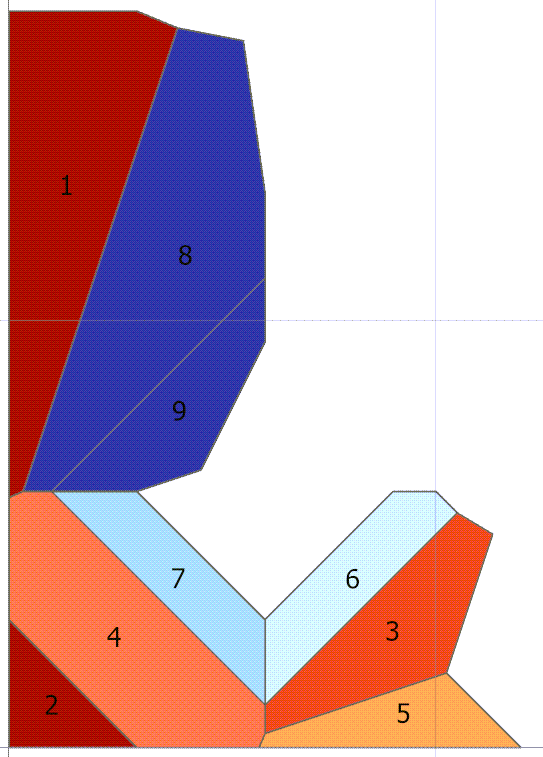
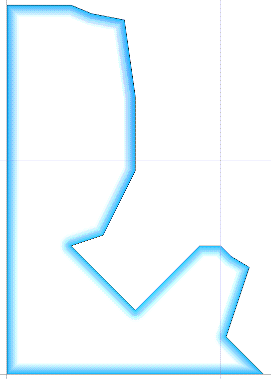
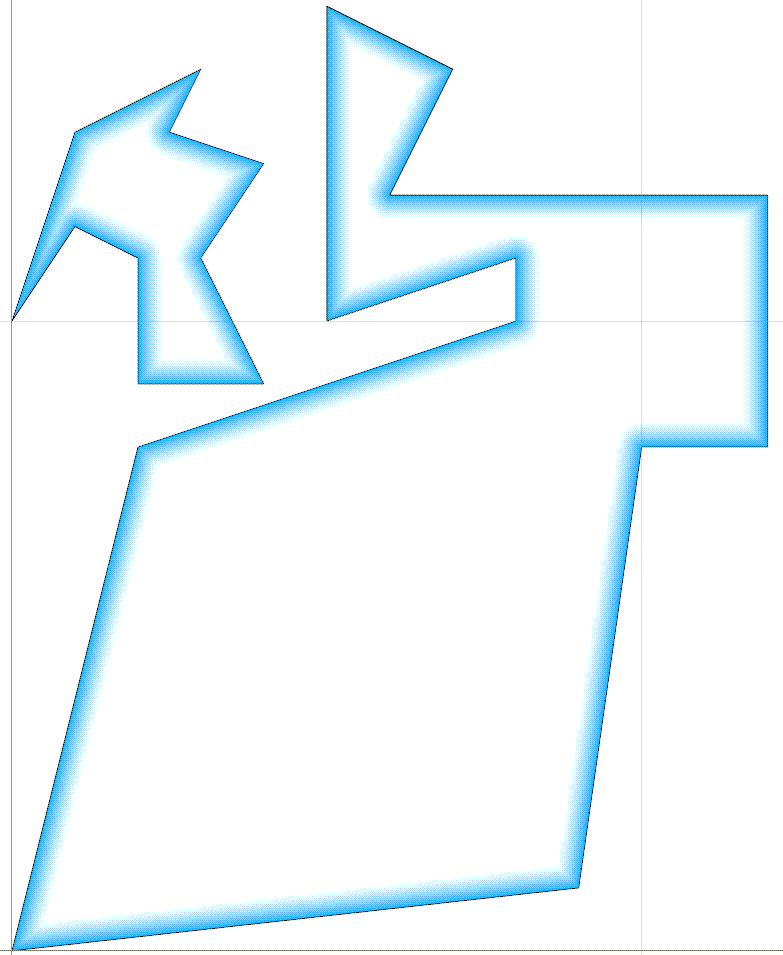
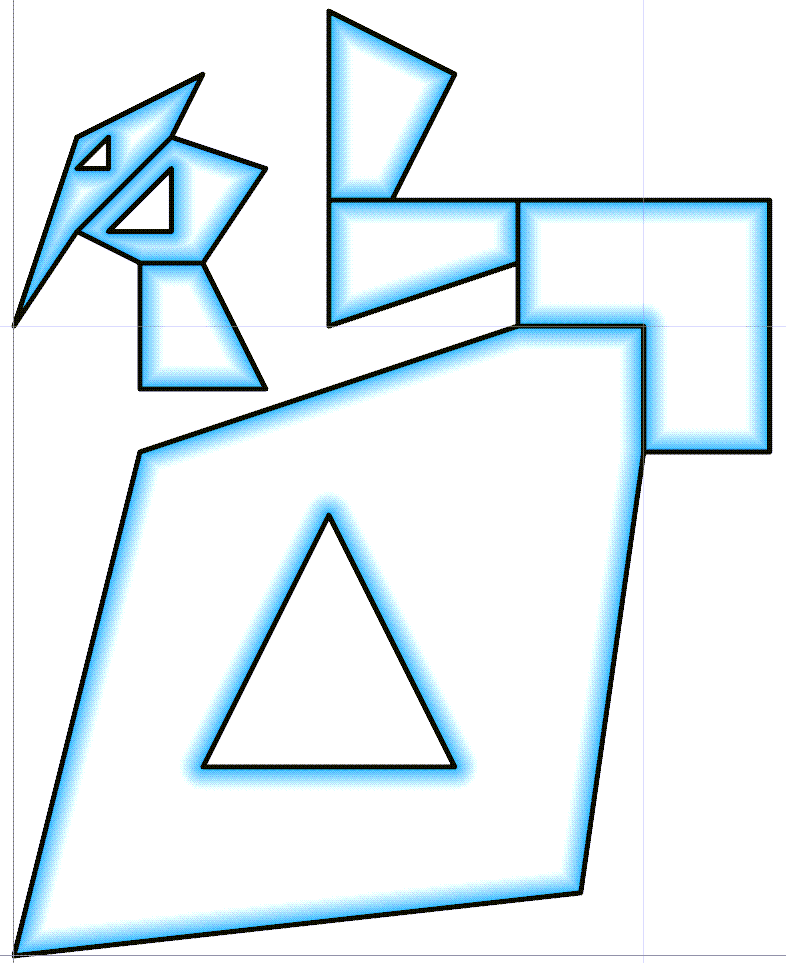

## Dissolve polygons ##

It exists already.

 Dissolve (Data Management tools) 

So why another one? 

Simple.  You need an attribute to dissolve on.

You are doing your aggregation of shapes based on a common attribute, so it is grouping things based on commonalities.

The work around, is to fill a column with a common attribute, then away you go.

As part of my work on the Geo array that I use for my Free Tools project, I began to explore how dissolve actually works.  Sadly, it isn't as simple as I thought and reading the academic papers or tearing apart code left me feeling a bit lost.  I admit, reading my code after a few days away leaves me feeling the same.

In short:

  - find common segments in your polygons
    - which means find the adjacent polygons, then
      - for each one find the common segment(s)
        - remembering that the edges of common segments will go in the opposite direction
          - and you have the floating point comparison thing
            - (I know I have forgot something... check my code ‌‌)

  - remove the common segments and rejoin the remaining segments
    - don't get me started... there are no examples of this in useful pseudo-code and
      - yeah, yeah, the plane sweep thingy, why does it take multiple classes to define one it is all just an array
        - don't forget the case where a polygon can join other polygons at multiple points
          - don't forget to keep those around that aren't done yet
            
  - are you keeping inner rings? (aka, holes)
  - what about multipart shapes? split them? keep them if they are disjoint?
  - what about meeting at a point?
  - I know, I know, two points sharing the same coordinates form a degenerate line, but there is no through access...
    my suggestion, dump'em until they learn to be more open.

So some examples:

Laughing person ... before and after dissolve

Note the shapes aren't in order which makes it a challenge.
You can do a lexicographic sort of the left-most coordinate to speed up the identification of adjoining shapes.

This example shows two groupings of geometry.  I chose the dump the holes option.

The Dissolve Boundaries tool

References

"https://github.com/Dan-Patterson/numpy_geometry" 
numpy geometry 

arcpro_npg ... npg ... (n)um(p)y (g)eometry the code

Try taking down a few boundaries yourself... either in life or geometry ‌‌ .
Bird on Dog ... before and after dissolve
