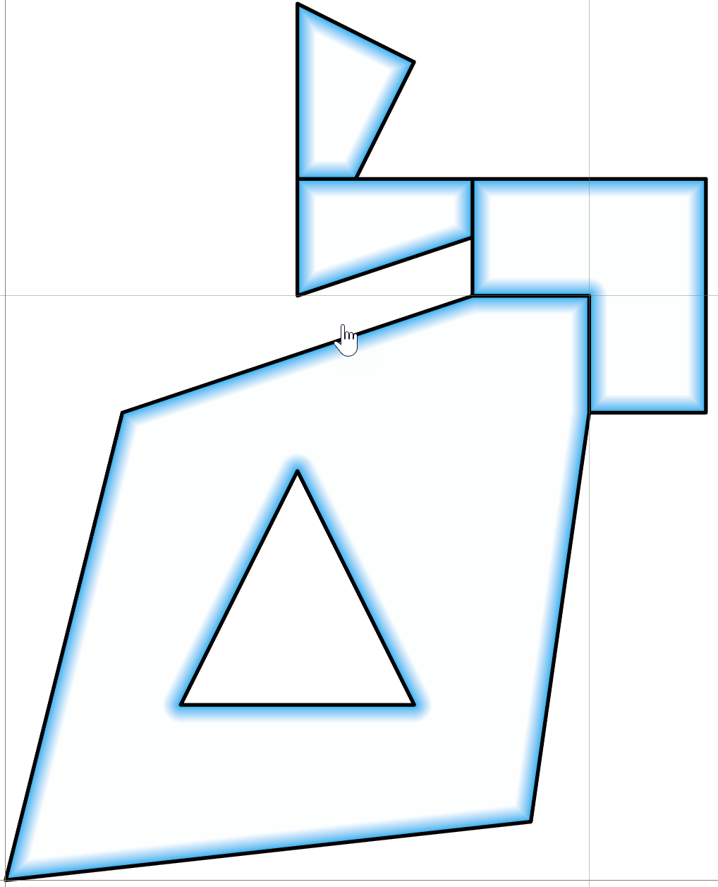

# Geometry as arrays #

- Basic constituents
- Array representation/printing

<details>
<summary markdown="span">Basic constituents</summary>

## Basic constituents

Take an array of 2D point objects.

```python
In [1]: sq
Out[1]: 
Geo([[   0.00,    0.00],
     [   2.00,    8.00],
     [   8.00,   10.00],
     [  10.00,   10.00],
     [  10.00,    8.00],
     [   9.00,    1.00],
     [   0.00,    0.00],
     [   3.00,    3.00],
     [   7.00,    3.00],
     [   5.00,    7.00],
     [   3.00,    3.00],
     [   8.00,   10.00],
     [   8.00,   11.00],
     [   8.00,   12.00],
     [  12.00,   12.00],
     [  12.00,    8.00],
     [  10.00,    8.00],
     [  10.00,   10.00],
     [   8.00,   10.00],
     [   5.00,   10.00],
     [   5.00,   12.00],
     [   6.00,   12.00],
     [   8.00,   12.00],
     [   8.00,   11.00],
     [   5.00,   10.00],
     [   5.00,   12.00],
     [   5.00,   15.00],
     [   7.00,   14.00],
     [   6.00,   12.00],
     [   5.00,   12.00]])
```
In this case, the array represents a **Geo** array, an array that represents polygon or polyline geometry.  The details are covered elsewhere.

The current interest is how this array can be reshaped to form other array types and how they appear.

The following method converts the Geo array to an *object* array since the shape of the constituent parts does not have the same shape.

```python
a = sq.as_arrays()

In [2]: a[0]  # a[0][0].shape => (7, 2), a[0][1].shape => (4, 2)
Out[2]: 
array([array([[   0.00,    0.00],
              [   2.00,    8.00],
              [   8.00,   10.00],
              [  10.00,   10.00],
              [  10.00,    8.00],
              [   9.00,    1.00],
              [   0.00,    0.00]]), array([[   3.00,    3.00],
                                           [   7.00,    3.00],
                                           [   5.00,    7.00],
                                           [   3.00,    3.00]])], dtype=object)


In [3]: a[1]  # a[1].shape => (8, 2)
Out[3]: 
array([[   8.00,   10.00],
       [   8.00,   11.00],
       [   8.00,   12.00],
       [  12.00,   12.00],
       [  12.00,    8.00],
       [  10.00,    8.00],
       [  10.00,   10.00],
       [   8.00,   10.00]])

In [4]: a[2]  # a[2].shape => (6, 2)
Out[4]: 
array([[   5.00,   10.00],
       [   5.00,   12.00],
       [   6.00,   12.00],
       [   8.00,   12.00],
       [   8.00,   11.00],
       [   5.00,   10.00]])

In [5]: a[3]  # a[3].shape => (5, 2)
Out[5]: 
array([[   5.00,   12.00],
       [   5.00,   15.00],
       [   7.00,   14.00],
       [   6.00,   12.00],
       [   5.00,   12.00]])

In [6]: a[0].dtype  # dtype('O')

In [7]: a[0][0].dtype, a[0][1].dtype  # (dtype('float64'), dtype('float64'))

In [8]: a[1].dtype  # dtype('float64')

In [9]: a[2].dtype  # dtype('float64')

In [10]: a[3].dtype  # dtype('float64')
```

The shape and dtype of the array depends on the part being examined.  The first array (a[0]) consists of two parts, an outer ring in clockwise order and an inner ring in counterclockwise order (a hole).  The shape of both parts is different, hence, the combination results in an object array, whereas the individual constituents are floating point arrays.

The remaining parts of the array are all singlepart arrays of the same dtype, but with different shapes.

Here it is.

<a href="url"></a>

<br clear="all">

----

</details>

<details>
<summary markdown="span">Array representation/printing</summary>         

## Array representation/printing

Now, lets look at some of the ways that you can represent those data in various forms.

```python
In [11]: prn_(a)
0 ...
[array([[   0.00,    0.00],
        [   2.00,    8.00],
        [   8.00,   10.00],
        [  10.00,   10.00],
        [  10.00,    8.00],
        [   9.00,    1.00],
        [   0.00,    0.00]]) array([[   3.00,    3.00],
                                    [   7.00,    3.00],
                                    [   5.00,    7.00],
                                    [   3.00,    3.00]])]
1 ...
[[   8.00   10.00]
 [   8.00   11.00]
 [   8.00   12.00]
 [  12.00   12.00]
 [  12.00    8.00]
 [  10.00    8.00]
 [  10.00   10.00]
 [   8.00   10.00]]
2 ...
[[   5.00   10.00]
 [   5.00   12.00]
 [   6.00   12.00]
 [   8.00   12.00]
 [   8.00   11.00]
 [   5.00   10.00]]
3 ...
[[   5.00   12.00]
 [   5.00   15.00]
 [   7.00   14.00]
 [   6.00   12.00]
 [   5.00   12.00]]

In [12]: prn_geo(sq)

 pnt shape  part  X       Y     
--------------------------------
 000     1          0.00    0.00
 001     1          2.00    8.00
 002     1          8.00   10.00
 003     1         10.00   10.00
 004     1         10.00    8.00
 005     1          9.00    1.00
 006     1          0.00    0.00
 007     1  -o      3.00    3.00
 008     1          7.00    3.00
 009     1          5.00    7.00
 010     1  ___     3.00    3.00
 011     2  -o      8.00   10.00
 012     2          8.00   11.00
 013     2          8.00   12.00
 014     2         12.00   12.00
 015     2         12.00    8.00
 016     2         10.00    8.00
 017     2         10.00   10.00
 018     2  ___     8.00   10.00
 019     3  -o      5.00   10.00
 020     3          5.00   12.00
 021     3          6.00   12.00
 022     3          8.00   12.00
 023     3          8.00   11.00
 024     3  ___     5.00   10.00
 025     4  -o      5.00   12.00
 026     4          5.00   15.00
 027     4          7.00   14.00
 028     4          6.00   12.00
 029     4          5.00   12.00

In [13]: prn_Geo_shapes(sq)

ID : Shape ID by part
R  : ring, outer 1, inner 0
P  : part 1 or more
 ID  R  P      x       y
  1  1  1  [   0.00    0.00]
           [   2.00    8.00]
           [   8.00   10.00]
           [  10.00   10.00]
           [  10.00    8.00]
           [   9.00    1.00]
           [   0.00    0.00]
  1  0  1  [   3.00    3.00]
           [   7.00    3.00]
           [   5.00    7.00]
           [   3.00    3.00]
  2  1  1  [   8.00   10.00]
           [   8.00   11.00]
           [   8.00   12.00]
           [  12.00   12.00]
           [  12.00    8.00]
           [  10.00    8.00]
           [  10.00   10.00]
           [   8.00   10.00]
  3  1  1  [   5.00   10.00]
           [   5.00   12.00]
           [   6.00   12.00]
           [   8.00   12.00]
           [   8.00   11.00]
           [   5.00   10.00]
  4  1  1  [   5.00   12.00]
           [   5.00   15.00]
           [   7.00   14.00]
           [   6.00   12.00]
           [   5.00   12.00]

```

For **In [11]** the *prn* function simply prints out the object array's constituent parts, numbering them at the same time.

**In [12]** provides another option to view the Geo array.  The **pnt shape  part  X       Y** header is added and the parts of the array are shown with the **-o** separator.

**In [13]** is another option for the Geo array.  A full header with the descriptor ** ID  R  P      x       y** provides point id information as well as the ring, part and x, y coordinate values.
</details>
</details>
