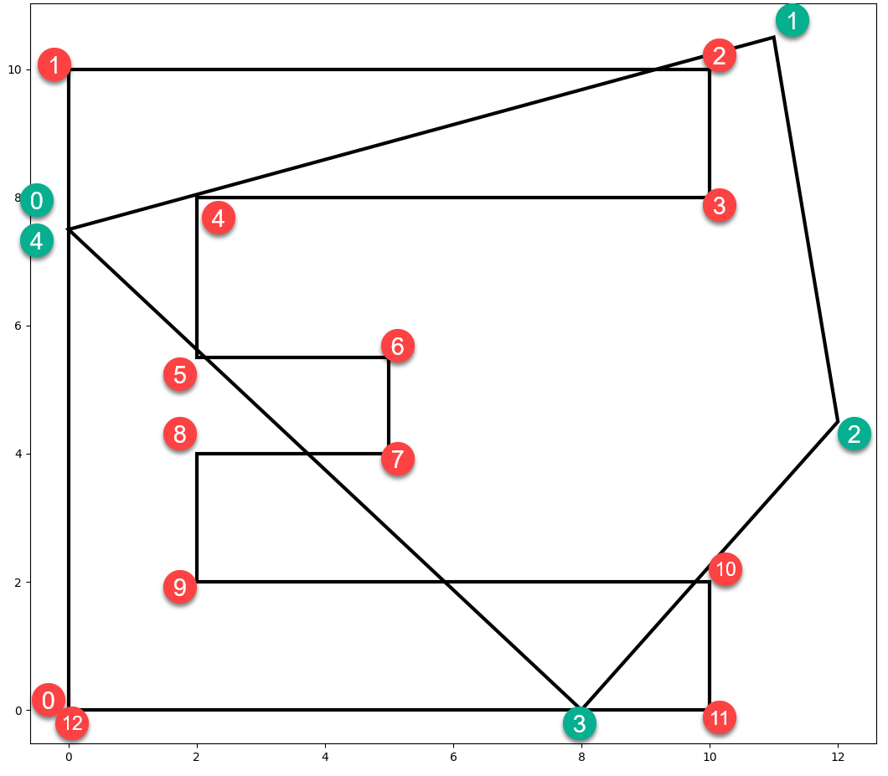

## Side



---
Which side?  Whose side?  Left side? Right side?

The points? Both? Just one? Which one?

The segment?

To answer these questions observe the red and green point markers numbered in clockwise order for each of the two polygons.

Our brain can quickly decide which side IF we know the ``sidedness rule``.  

If the segments are ordered clockwise, then any point will be *inside* if it is to the *right*.
If the polygon that we are testing as the home for the points is convex, then an inside point
will be to the right of all the line segments.

This is the principle behind the *winding number* test for point inclusion.  It, however, accounts
for idiosyncracies that are associated with concave polygons.

**Looking at sides**

The ``_side_`` code listed below, returns four values.

- r       : the side array
- inside  : the points inside (right of) a segment
- outside : the points outside (left of) a segment
- equal_  : any points that may intersect (equal to) one another by virtue of their equality or potential intersection on the segment.

```python

# check b4 for inclusion in c1
b4                             c1 
array([[  0.00,  10.00],    array([[  0.50,  10.50],
       [  1.00,  13.00],           [  0.50,  15.00],
       [  3.00,  14.00],           [  2.50,  13.50],
       [  2.50,  13.00],           [  6.50,  15.00],
       [  1.00,  11.50],           [  5.50,  10.50],
       [  0.00,  10.00]])          [  2.00,  11.50],
                                   [  0.50,  10.50]])

r, inside, outside, equal_ = _side_(b4, c1)

r
array([[  2.25, -10.75, -10.25, -24.25,   7.25,   0.25],
       [ -2.25,  -3.25,   0.25, -22.75,  -4.25,  -3.25],
       [-11.25,   1.75,   1.25, -14.75,  -9.75,  -2.75],
       [ -9.00,  -1.00,  -2.00, -16.00,  -5.75,  -1.75],
       [ -2.25,  -6.25,  -5.75, -21.25,   1.00,  -1.00],
       [  2.25, -10.75, -10.25, -24.25,   7.25,   0.25]])

(r < 0)                      r > 0
array([[0, 1, 1, 1, 0, 0],   array([[1, 0, 0, 0, 1, 1],
       [1, 1, 0, 1, 1, 1],          [0, 0, 1, 0, 0, 0],
       [1, 0, 0, 1, 1, 1],          [0, 1, 1, 0, 0, 0],
       [1, 1, 1, 1, 1, 1],          [0, 0, 0, 0, 0, 0],
       [1, 1, 1, 1, 0, 1],          [0, 0, 0, 0, 1, 0],
       [0, 1, 1, 1, 0, 0]])         [1, 0, 0, 0, 1, 1]])

inside                     outside                    equal_
array([[  2.50,  13.00]])  array([[  0.00,  10.00],   array([],
                                  [  1.00,  13.00],         shape=(0, 2),
                                  [  3.00,  14.00],          dtype=float64)
                                  [  1.00,  11.50],
                                  [  0.00,  10.00]])

# -- calculate terms
#
lt0 = (r < 0).all(axis=-1)  # array([0, 0, 0, 1, 0, 0])
gt0 = (r > 0).any(-1)       # array([1, 1, 1, 0, 1, 1])
eq0 = (r == 0).any(-1)      # array([0, 0, 0, 0, 0, 0])


_wn_(b4, c1)
Out[108]: 
(array([[  1.00,  13.00],
        [  2.50,  13.00],
        [  1.00,  11.50]]),
 array([ 0, -1,  0, -1, -1,  0]))

r, inside, outside, equal_ = _side_(b4, c1)


```
