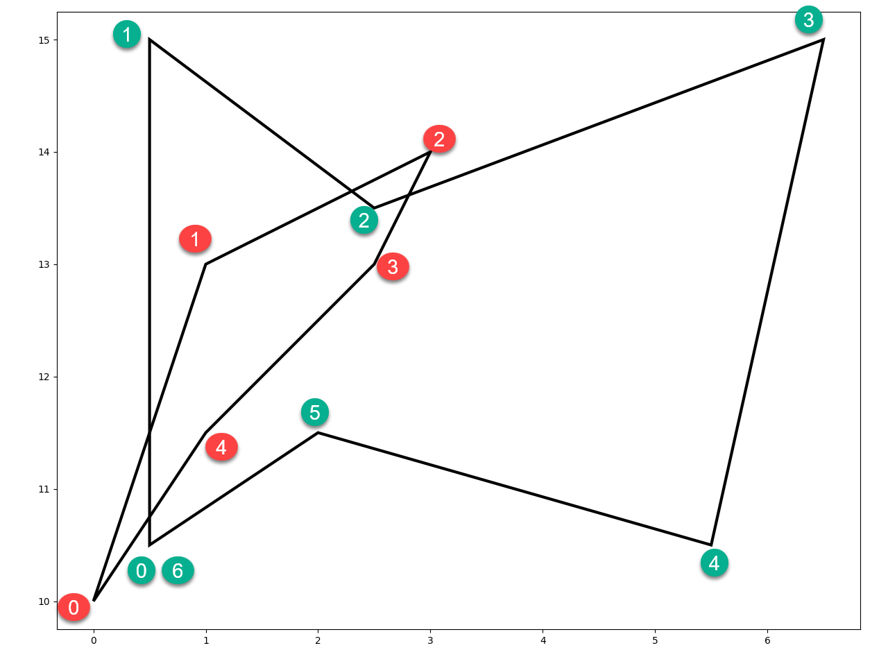

## Side



---
Which side?  Whose side?  Left side? Right side?

The points? Both? Just one? Which one?

The segment?

To answer these questions observe the red and green point markers numbered in clockwise order for each of the two polygons.

Our brain can quickly decide which side IF we know the ``sidedness rule``.  

If the segments are ordered clockwise, then any point will be *inside* if it is to the *right*.
If the polygon that we are testing as the home for the points is convex, then an inside point
will be to the right of all the line segments.

This is the principle behind the *winding number* test for point inclusion.  It, however, accounts
for idiosyncracies that are associated with concave polygons.

**Looking at sides**

The ``_side_`` code listed below, returns four values.

- r       : the side array
- inside  : the points inside (right of) a segment
- outside : the points outside (left of) a segment
- equal_  : any points that may intersect (equal to) one another by virtue of their equality or potential intersection on the segment.

```python

# check b4 for inclusion in c1
b4                             c1 
array([[  0.00,  10.00],    array([[  0.50,  10.50],
       [  1.00,  13.00],           [  0.50,  15.00],
       [  3.00,  14.00],           [  2.50,  13.50],
       [  2.50,  13.00],           [  6.50,  15.00],
       [  1.00,  11.50],           [  5.50,  10.50],
       [  0.00,  10.00]])          [  2.00,  11.50],
                                   [  0.50,  10.50]])
```
The coordinates for ``b4`` are used here to just represent points.  The actually form a polygon, yet they need not.

The ``c1`` array represents a polygon, as per previous definition.

The ``_side_`` function returns the set of values shown below.  ``r`` is the cross-product array, from which terms used to determine parameters.

Two versions of determining points inside (``in_`` and ``inside``) are calculated.  ``in_`` incorporates winding-number calculations for point
inclusion in polygons.  It is interesting to examine under what circumstances these parameters are similar or different.

```python
r, in_, inside, outside, equal_ = _side_(b4, c1)

r
array([[  2.25, -10.75, -10.25, -24.25,   7.25,   0.25],
       [ -2.25,  -3.25,   0.25, -22.75,  -4.25,  -3.25],
       [-11.25,   1.75,   1.25, -14.75,  -9.75,  -2.75],
       [ -9.00,  -1.00,  -2.00, -16.00,  -5.75,  -1.75],
       [ -2.25,  -6.25,  -5.75, -21.25,   1.00,  -1.00],
       [  2.25, -10.75, -10.25, -24.25,   7.25,   0.25]])

(r < 0)                      r > 0
array([[0, 1, 1, 1, 0, 0],   array([[1, 0, 0, 0, 1, 1],
       [1, 1, 0, 1, 1, 1],          [0, 0, 1, 0, 0, 0],
       [1, 0, 0, 1, 1, 1],          [0, 1, 1, 0, 0, 0],
       [1, 1, 1, 1, 1, 1],          [0, 0, 0, 0, 0, 0],
       [1, 1, 1, 1, 0, 1],          [0, 0, 0, 0, 1, 0],
       [0, 1, 1, 1, 0, 0]])         [1, 0, 0, 0, 1, 1]])

inside                     outside                    equal_
array([[  2.50,  13.00]])  array([[  0.00,  10.00],   array([],
                                  [  1.00,  13.00],         shape=(0, 2),
                                  [  3.00,  14.00],          dtype=float64)
                                  [  1.00,  11.50],
                                  [  0.00,  10.00]])

# -- calculate in_ using winding number 
_wn_(b4, c1)
array([[  1.00,  13.00],
       [  2.50,  13.00],
       [  1.00,  11.50]])
array([ 0, -1,  0, -1, -1,  0]))
#
lt0 = (r < 0).all(axis=-1)  # array([0, 0, 0, 1, 0, 0])
gt0 = (r > 0).any(-1)       # array([1, 1, 1, 0, 1, 1])
eq0 = (r == 0).any(-1)      # array([0, 0, 0, 0, 0, 0])

```
**_side_ the code**

The number of points in each geometry object need not be the same since array-broadcasting is used to
facilitate the calculations.

A term like ``y0[:, None]`` and other variants change the shape and dimension of the array as follows:

```python
y0  # -- the base array
# y0.ndim  : 1
# y0.shape : (6,)
# array([ 10.00,  13.00,  14.00,  13.00,  11.50,  10.00])

# reshape to produce a column array.
y0[:, None]  # ndim = 2, shape = (6, 1)
array([[ 10.00],
       [ 13.00],
       [ 14.00],
       [ 13.00],
       [ 11.50],
       [ 10.00]])

# reshape to change the row array to a 2D array... note the additional [ ] around the coordinates
y0[None, :]  # ndim = 2, shape = (1, 6)
array([[ 10.00,  13.00,  14.00,  13.00,  11.50,  10.00]])
```

If you start with 2D arrays, then the transitions move them to 3D arrays.

```python
pnts[:, None]
# ndim = 3
# shape = (6, 1, 2)
#
array([[[  0.00,  10.00]],

       [[  1.00,  13.00]],

       [[  3.00,  14.00]],

       [[  2.50,  13.00]],

       [[  1.00,  11.50]],

       [[  0.00,  10.00]]])

pnts[None, :]
# ndim = 3
# shape = (1, 6, 2)
#
array([[[  0.00,  10.00],
        [  1.00,  13.00],
        [  3.00,  14.00],
        [  2.50,  13.00],
        [  1.00,  11.50],
        [  0.00,  10.00]]])

```

The principles of ``_side_`` are used in subsequent code examples for polygon splitting, clipping and other overlay operations.

```python
def _side_(pnts, poly):
    """Return points inside, outside or equal/crossing a convex poly feature."""
    if pnts.ndim < 2:
        pnts = np.atleast_2d(pnts)
    x0, y0 = pnts.T           # the x and y points
    x2, y2 = poly[:-1].T      # poly segment start points
    x3, y3 = poly[1:].T       # poly segment end points
    r = (x3 - x2) * (y0[:, None] - y2) - (y3 - y2) * (x0[:, None] - x2)
    # -- from _wn_, winding numbers for concave/convex poly
    chk1 = ((y0[:, None] - y2) >= 0.)
    chk2 = (y0[:, None] < y3)
    chk3 = np.sign(r).astype(np.int)
    pos = (chk1 & chk2 & (chk3 > 0)).sum(axis=1, dtype=int)
    neg = (~chk1 & ~chk2 & (chk3 < 0)).sum(axis=1, dtype=int)
    wn_vals = pos - neg
    in_ = pnts[np.nonzero(wn_vals)]
    inside = pnts[(r < 0).all(axis=-1)]  # all True along row, convex polys only
    outside = pnts[(r > 0).any(-1)]      # any True along row
    equal_ = pnts[(r == 0).any(-1)]      # ditto
    return r, in_, inside, outside, equal_

```

